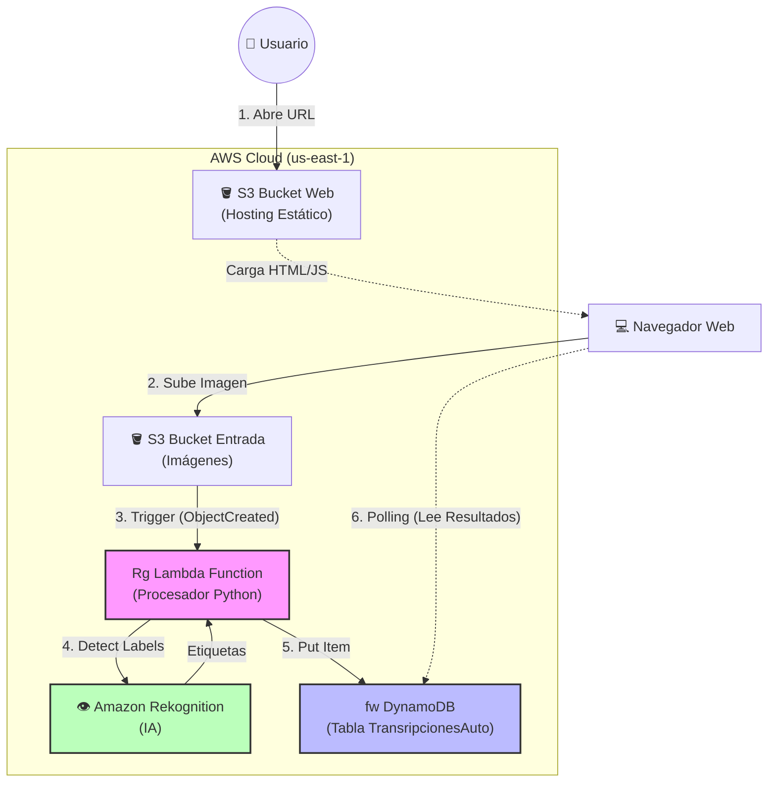

```mermaid
graph TD
    User((👤 Usuario))
    Browser["💻 Navegador Web"]
    
    subgraph "AWS Cloud (us-east-1)"
        S3Web["🪣 S3 Bucket Web\n(Hosting Estático)"]
        S3Input["🪣 S3 Bucket Entrada\n(Imágenes)"]
        Lambda["Rg Lambda Function\n(Procesador Python)"]
        Rekognition["👁️ Amazon Rekognition\n(IA)"]
        DynamoDB["fw DynamoDB\n(Tabla TransripcionesAuto)"]
    end

    %% Flujo
    User -->|"1. Abre URL"| S3Web
    S3Web -.->|"Carga HTML/JS"| Browser
    Browser -->|"2. Sube Imagen"| S3Input
    S3Input -->|"3. Trigger (ObjectCreated)"| Lambda
    Lambda -->|"4. Detect Labels"| Rekognition
    Rekognition -- "Etiquetas" --> Lambda
    Lambda -->|"5. Put Item"| DynamoDB
    Browser -.->|"6. Polling (Lee Resultados)"| DynamoDB

    %% Estilos
    style Lambda fill:#f9f,stroke:#333,stroke-width:2px
    style DynamoDB fill:#bbf,stroke:#333,stroke-width:2px
    style Rekognition fill:#bfb,stroke:#333,stroke-width:2px
```
